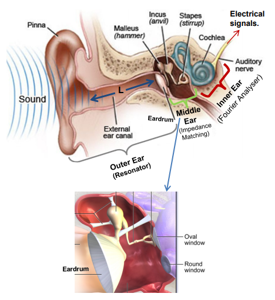
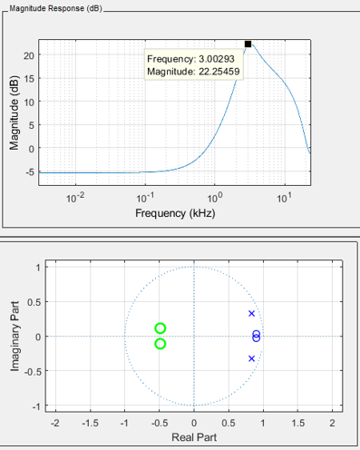
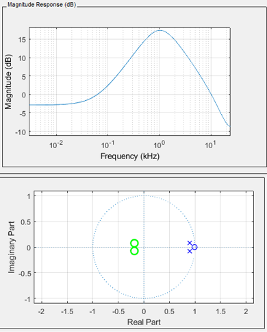
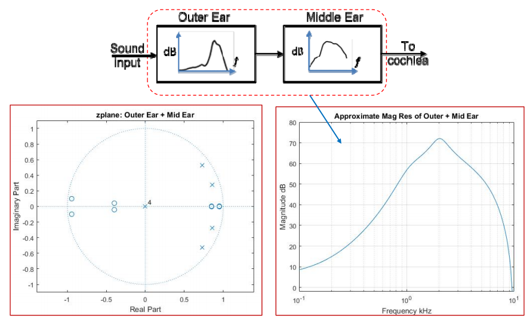
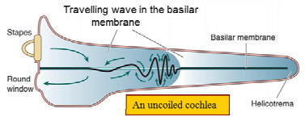
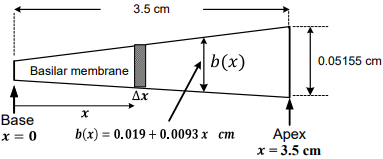
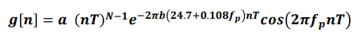
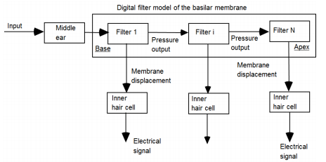
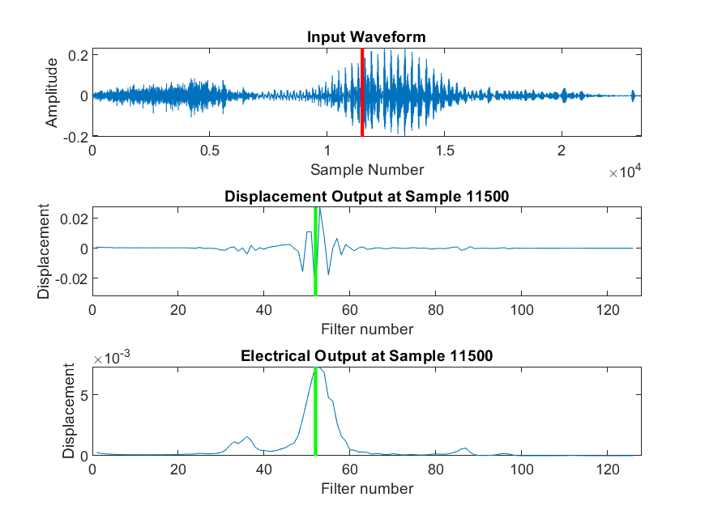

# Human Ear Model
The human ear is a complex system responsible for converting pressure variations into interpretable electrical signals by the brain. The peripheral system is composed of three sections, each with a purpose in the process:
1. Outer Ear: A resonator
2. Middle Ear: An impedance matcher
3. Inner Ear: Mechanical to electrochemical impulses

    

## Files
**`middleFilter.m:`** The filter function that models the response of the middle and outer human ear

**`EarModel.m:`** Main function that models the response with any given sample audio

**`three.wav:`** Sample audio of a person saying "three", used for model implementation

## Implementation
The outer ear model which consists of the pinna and ear canal produce a resonant frequency of roughly 3kHz with a peak gain of 20dB, represented through the following resonator model:

    

The middle ear model consists of the Malleus, Incus and Stapes (Auditory Ossicles) and form an impedance matcher and amplifier. This translates to a response of 18dB at a resonant pole of 1kHz: 

    

Together, these two filters are cascaded to form a filter that is then fed into the cochlea. The function in `middleFilter.m` achieves this in the following fashion:

    

Finally, the inner ear contains the cochlea which converts the vibrations received from the previous models and converts them into electrochemical impulses which are passed on to the brain through the auditory nerve. The cochlea is specified to be 3.5cm in length when uncoiled, and ar partitioned into two fuid canals, the scala vestibuli and scala tympani. Between them, the basilar membrane rests as a resonant structure, varying in width and stiffness which causes there to be different resonant frequencies at different points of the membrane. For this model, the assumption will be a resonant frequency range from 70Hz to 16kHz.

    

At each point of the basilar membrane, a passband filter will extract the impulse response of the passing signal. The number of impulse segments for this section is specified by default as 71, while the impulse response is given by:

    

where, ݂

1. *f* is the centre frequency
2. *T* is the sampling period
3. *n* ݊ is the discrete time sample index
4. *N* is the order of the filter
5. *a* is a constant chosen such that the filter gain at the centre frequency is 0dB.

Each filter response is detected through hairs (cilia) that stick up from the organ of corti which convert the detected movement into electrical signals sent to the brain. As the cilia are only bent in one direction, this can be liken to a half-wave rectifier, before passing through a smoothing function that mimics the time it takes for the cilia to return to the original position. A spatial differentiation acts as the high-pass filter and will smooth the output of the inner hair cell. 

    

## Outputs
The final output displays three comparative waveforms and a detected peak frequency:
1. The original waveform and the selected time sample window that was filtered
2. The impulse output of the given time sample window
3. The electrical impulse output of the prior impulse

    

For the default settings and results above, the system will output:

`Peak filter 52 at 2252.3681 Hz`

## References
1. Duifhuis H (2012) Cochlear Mechanics: Introduction to a time-domain analysis of the nonlinear cochlea.

2. Shera CA, Guinan JJ, Oxenham AJ (2002) Revised estimates of human cochlear tuning from otoacoustic and behavioral measurements.